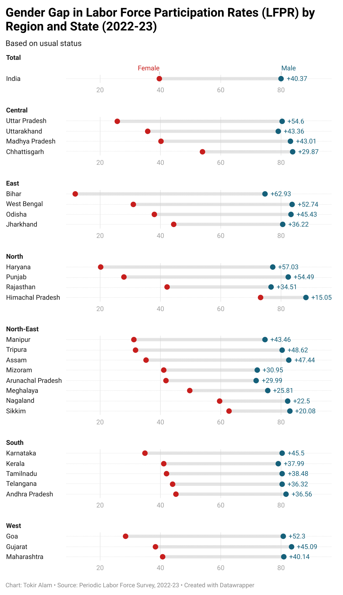
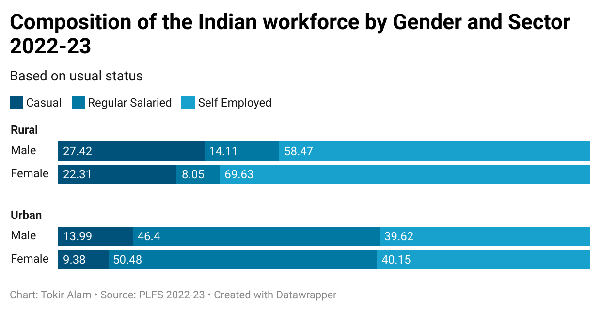
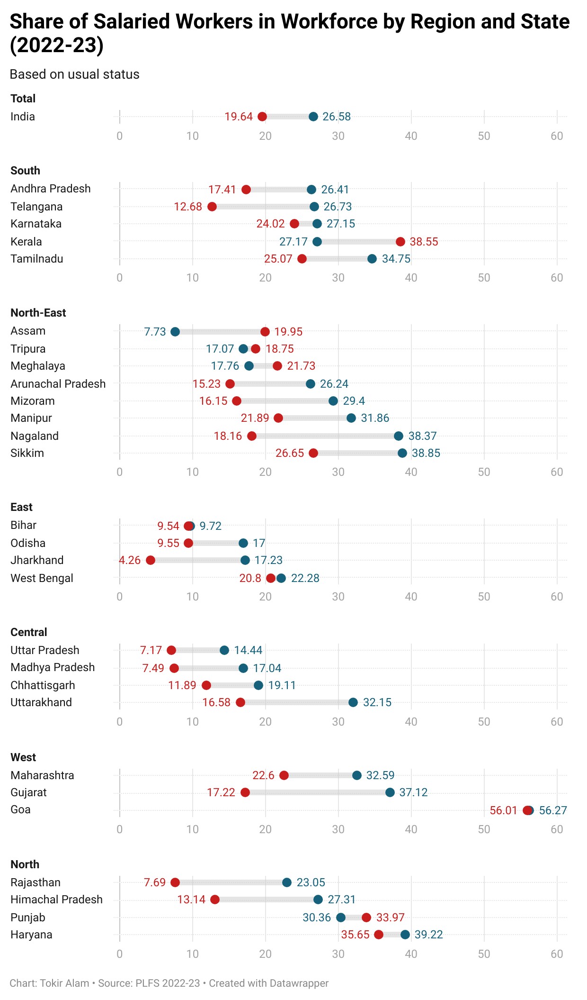
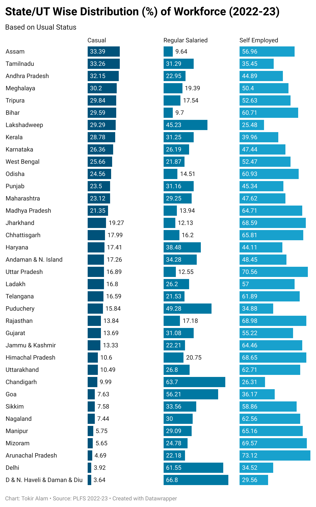
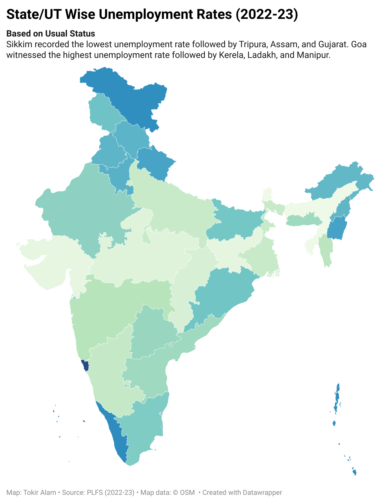

# Analysis---Periodic-Labor-Force-Survey
## Labor Force Participation Rates Across Indian States 

The chart highlights significant variations in labor force participation rates (LFPR) across Indian states for the working-age population (15–59 years). Himachal Pradesh leads with an impressive LFPR of over 80%, indicating strong workforce engagement. Northeastern states like Sikkim, Nagaland, and the Union Territory of Andaman & Nicobar Islands also show high participation. In contrast, states like Bihar (43.9%), Delhi (45.3%), and Lakshadweep (45.5%) are at the bottom, pointing to relatively lower engagement of the working-age population in economic activities. The national average stands at 59.3%, suggesting that many states still lag behind the desired levels of labor market inclusion. This variation could reflect differences in education levels, availability of work, industrial composition, and social norms around work, especially for women.

## Gender Gap in Labor Force Participation Rates (LFPR) by Region and State 

This visualization captures the gender disparity in labor force participation across Indian states in 2022–23. It shows that men participate in the workforce at much higher rates than women in every region. Northern and Eastern states like Bihar, Punjab, and Haryana reflect particularly wide gaps, with low female participation. In contrast, several North-Eastern states such as Sikkim and Nagaland show narrower differences, indicating relatively better inclusion. Southern states fall somewhere in the middle, with moderate gaps.

## Composition of Indian Workforce by Gender and Sector

In rural areas, self-employment dominates, especially among women, with nearly 70% engaged in it compared to about 58% of men. Casual labor also forms a significant share for both genders, though slightly more for men (27.4%) than women (22.3%). Regular salaried jobs are scarce in rural India overall but even more limited for women, who make up just 8% in this category.   

In urban areas, regular salaried employment becomes the dominant form for both sexes. However, urban women show a slightly higher share (50.5%) in this segment than men (46.4%). Casual labor is less common in cities, but men still do more of it than women. Interestingly, the share of self-employment is nearly balanced between urban men and women, though slightly lower compared to rural areas.

This chart shows the percentage of salaried workers in the workforce across different Indian states and regions, based on the usual status from PLFS 2022–23 data.

At the national level, salaried employment accounts for 26.58% of the workforce, with 19.64% of women and 26.58% of men being salaried.

## Share of Salaried Workers in Workforce by Region and State

#### Regional Highlights:

**North:** States like Haryana (39.22%) and Punjab (33.97%) have relatively higher shares of salaried workers. Haryana also records one of the highest shares among females (35.65%).

**South:** Tamil Nadu (34.75%) and Kerala (27.17%) show strong salaried employment, especially among women in Tamil Nadu (25.07%).

**West:** Goa (56.27%) stands out with the highest share of salaried workers overall and among both genders (56.01% women and 56.27% men).

**Central & East:** These regions generally have lower shares of salaried employment. Bihar (9.72%), Jharkhand (17.23%), and Madhya Pradesh (17.04%) are examples.

**North-East:** Mixed results—Nagaland (38.37%) and Sikkim (38.85%) are high, while Assam (7.73%) and Tripura (17.07%) are on the lower end.

The data reflects stark regional and gender-based disparities in salaried employment.

## State/UT-wise Distribution (%) of Workforce in India

The data reveals significant regional disparities. For instance, Delhi and Chandigarh have the highest share of regular salaried workers (61.55% and 63.7%, respectively), reflecting their urban nature and formal job availability. On the other hand, states like Arunachal Pradesh (73.12%) and Uttar Pradesh (70.56%) show a heavy reliance on self-employment. Casual labor is more dominant in states such as Assam (33.39%) and Tamil Nadu (33.26%). The visualization highlights the continued prevalence of informal work arrangements across most of India, with only a few regions showing a high share of stable, salaried employment.

## State-Wise Unemployment Trends in India

The map on State/UT-wise unemployment rates for 2022–23, based on the usual status, reveals striking regional disparities in employment patterns across India. Sikkim recorded the lowest unemployment rate in the country, followed closely by Tripura, Assam, and Gujarat. These states show relatively better employment absorption, possibly due to a larger presence of informal employment or stable traditional sectors that keep unemployment figures low.   

On the other end of the spectrum, Goa witnessed the highest unemployment rate, despite leading in the share of salaried workers within its workforce. This paradox suggests a possible mismatch between the types of jobs available and the expectations or qualifications of the workforce, particularly among educated youth. Kerala, Ladakh, and Manipur also showed high unemployment levels, reflecting underlying structural challenges in their labor markets. These regions, though often ranked high in education and health indicators, struggle with translating human capital into adequate job opportunities.
